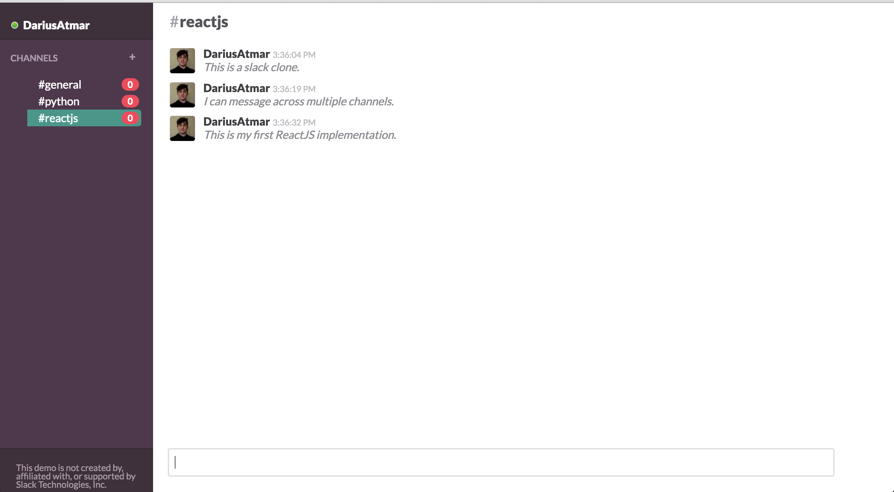

# slack-clone-react

## About

This is my first attempt at building a React app. It is a simple single page slack clone that allows for the creation of new channels and messages.

I followed a tutorial from CodeUpStart.

##Dependencies
- jquery
- browserify
- watchify
- reactify

